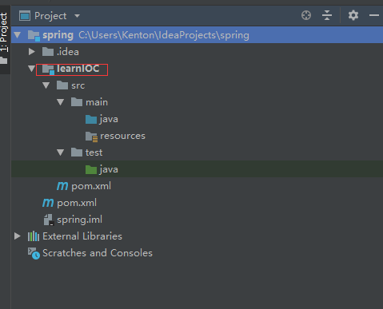
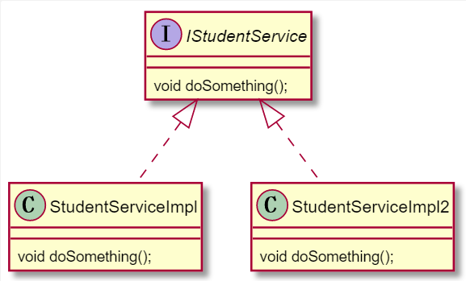

# 1.spring开发环境搭建
# 1.1 pom依赖
```xml
<dependencies>
        <!-- spring核心包 -->
        <dependency>
            <groupId>org.springframework</groupId>
            <artifactId>spring-webmvc</artifactId>
            <version>4.3.14.RELEASE</version>
        </dependency>
        <dependency>
            <groupId>org.springframework</groupId>
            <artifactId>spring-core</artifactId>
            <version>4.3.14.RELEASE</version>
        </dependency>
        <dependency>
            <groupId>org.springframework</groupId>
            <artifactId>spring-beans</artifactId>
            <version>4.3.14.RELEASE</version>
        </dependency>

        <dependency>
            <groupId>org.springframework</groupId>
            <artifactId>spring-context</artifactId>
            <version>4.3.14.RELEASE</version>
        </dependency>

        <dependency>
            <groupId>org.springframework</groupId>
            <artifactId>spring-context-support</artifactId>
            <version>4.3.14.RELEASE</version>
        </dependency>

        <dependency>
            <groupId>org.springframework</groupId>
            <artifactId>spring-aop</artifactId>
            <version>4.3.14.RELEASE</version>
        </dependency>

        <dependency>
            <groupId>org.springframework</groupId>
            <artifactId>spring-aspects</artifactId>
            <version>4.0.9.RELEASE</version>
        </dependency>

        <dependency>
            <groupId>org.springframework</groupId>
            <artifactId>spring-tx</artifactId>
            <version>4.3.14.RELEASE</version>
        </dependency>

        <dependency>
            <groupId>org.springframework</groupId>
            <artifactId>spring-web</artifactId>
            <version>4.3.14.RELEASE</version>
        </dependency>

        <dependency>
            <groupId>org.springframework</groupId>
            <artifactId>spring-jdbc</artifactId>
            <version>4.3.14.RELEASE</version>
        </dependency>

        <!-- AOP begin -->
        <dependency>
            <groupId>org.aspectj</groupId>
            <artifactId>aspectjrt</artifactId>
            <version>1.7.4</version>
        </dependency>
        <dependency>
            <groupId>org.aspectj</groupId>
            <artifactId>aspectjweaver</artifactId>
            <version>1.7.4</version>
        </dependency>
        <dependency>
            <groupId>cglib</groupId>
            <artifactId>cglib</artifactId>
            <version>3.1</version>
        </dependency>
        <!-- mybatis核心包 -->
        <dependency>
            <groupId>org.mybatis</groupId>
            <artifactId>mybatis</artifactId>
            <version>3.4.6</version>
        </dependency>

        <!--mybatis spring 插件 -->
        <dependency>
            <groupId>org.mybatis</groupId>
            <artifactId>mybatis-spring</artifactId>
            <version>1.2.2</version>
        </dependency>

        <!-- Mysql数据库驱动包 -->
        <dependency>
            <groupId>mysql</groupId>
            <artifactId>mysql-connector-java</artifactId>
            <version>5.1.34</version>
        </dependency>

        <!-- connection pool -->
        <dependency>
            <groupId>com.alibaba</groupId>
            <artifactId>druid</artifactId>
            <version>1.0.5</version>
            <scope>runtime</scope>
        </dependency>

        <!-- 日志文件管理包 -->
        <!-- log start -->
        <dependency>
            <groupId>org.apache.logging.log4j</groupId>
            <artifactId>log4j-core</artifactId>
            <version>2.11.1</version>
        </dependency>
        <dependency>
            <groupId>org.slf4j</groupId>
            <artifactId>slf4j-api</artifactId>
            <version>1.7.25</version>
        </dependency>
        <dependency>
            <groupId>org.slf4j</groupId>
            <artifactId>slf4j-log4j12</artifactId>
            <version>1.7.25</version>
        </dependency>
        <!-- log end -->
    </dependencies>
```
# 1.2创建子module



# 2.Bean的装配
## 2.1关于ApplicationContext 跟 BeanFactroy
当spring配置文件采用默认配置时，在执行ApplicationContext ctx =ClassPathXmlApplicationContext("");就会自动创建容器内的**所有对象**。
例子类图如下：

而BeanFactory则相反，它只有在执行beanFactory.getBean();时才会创建对象。
代码演示如下：
```java
    public void testApplicationContext(){
        System.out.println("例子1：");
        ApplicationContext context =new ClassPathXmlApplicationContext("applicationContext.xml");
        System.out.println("已经执行完无参构造方法啦！");
        IStudentService studentService = context.getBean("studentService", StudentServiceImpl.class);
        studentService.doSomething();

        System.out.println("例子2：");
        BeanFactory beanFactory =new XmlBeanFactory(new ClassPathResource("applicationContext.xml"));
        System.out.println("要执行无参构造方法啦！");
        IStudentService studentService3 = beanFactory.getBean("studentService", StudentServiceImpl.class);
        studentService3.doSomething();
    }
```
输出如下：
```log
例子1：
StudentServiceImpl constructor
StudentServiceImpl2 constructor
已经执行完无参构造方法啦！
StudentServiceImpl.....doSomethingMethod

例子2:
要执行无参构造方法啦！
StudentServiceImpl constructor
StudentServiceImpl.....doSomethingMethod
```
# 3.工厂bean
## 3.1动态工厂类
工厂类demo：
```java
public class ServiceFactory {
    public IStudentService getStudentService(){
        return  new StudentServiceImpl();
    }
}
```
为了实现动态工厂对StudentServiceImpl对象的自动装配，需要如下在spring配置文件中进行如下配置：
```xml
<bean id="serviceFactory" class="com.factory.ServiceFactory"/>
<bean id="studentService" factory-bean="serviceFactory" factory-method="getStudentService"/>
```
测试方法及测试结果如下：
```java
    @Test
    public void testFactory(){
        ApplicationContext ctx =new ClassPathXmlApplicationContext("applicationContext.xml");
        IStudentService studentService = ctx.getBean("studentService", StudentServiceImpl.class);
        studentService.doSomething();
    }


    StudentServiceImpl constructor
    StudentServiceImpl.....doSomethingMethod
```
## 3.2 静态工厂bean
由于静态工厂创建对象时采用 类名.方法名的方式，故而不需要在配置工厂类的bean。静态工厂类的配置文件如下：
```xml
  <!--<bean id="serviceFactory" class="com.factory.ServiceFactory"/>-->
  <bean id="studentService" class="com.factory.ServiceFactory" factory-method="getStudentService"/>
```
# 3.3 Bean的作用域
先看例子
```java
    public void testBean(){
        ApplicationContext ctx =new ClassPathXmlApplicationContext("applicationContext.xml");
        IStudentService studentService = ctx.getBean("studentService", StudentServiceImpl.class);
        IStudentService studentService2 = ctx.getBean("studentService", StudentServiceImpl.class);
        System.out.println("studentService==studentService2:"+(studentService==studentService2));
    }
    
    StudentServiceImpl constructor
    studentService==studentService2:true
```
 studentService==studentService2的结果为true的原因在于：由于容器初始化时就创建好了对象，在执行IStudentService studentService = ctx.getBean("studentService", StudentServiceImpl.class);时仅仅是将现有对象的引用给了studentService。由此可见，spring容器创建对象的方式采用了**单例模式**。

要想在访问时再创建对象，可以在bean中增加scope属性
```xml
 <bean id="studentService" class="com.service.impl.StudentServiceImpl"  scope="prototype"/>
```
这里简单复习下单例模式：
懒汉式单例：
```java
/*
*是否 Lazy 初始化：是
*是否多线程安全：是，如果没加synchronized关键字则不是线程安全的 
*实现难度：易
*描述：这种方式具备很好的 lazy loading，能够在多线程中很好的工作，但是，效率很低，99% 情况下不需要同步。
*优点：第一次调用才初始化，避免内存浪费。
*缺点：必须加锁 synchronized 才能保证单例，但加锁会影响效率。
*/
public class SingletonLazy {
    private SingletonLazy(){}
    private static SingletonLazy singletonLazy;
    public static  synchronized SingletonLazy getInstance(){
        if(singletonLazy!=null){
            singletonLazy =new SingletonLazy();
        }
        return singletonLazy;
    }
}
```
懒汉式单例的另一只实现方式：
```java
/***
 * 懒汉式 （静态内部类）
 */
public class SingletonLazy2 {

    private static boolean initialized = false;
    private SingletonLazy2() {
        //解决反射破坏到单例
        synchronized (SingletonLazy2.class) {
            if (!initialized) {
                initialized = true;
            } else {
                throw new RuntimeException("禁止初始化...");
            }
        }
    }

    //静态的内部类（寄生虫）,解决多线程安全问题
    private static class LazyHolder {
        private static final SingletonLazy2 LAZY = new SingletonLazy2();
    }

    public static SingletonLazy2 getInstance() {
        return SingletonLazy.LAZY;
    }
}
```
饿汉式单例：
``` java
/*
*是否 Lazy 初始化：否
*是否多线程安全：是
*实现难度：易
*描述：这种方式比较常用，但容易产生垃圾对象。
*优点：没有加锁，执行效率会提高。
*缺点：类加载时就初始化，浪费内存。
*它基于 classloder 机制避免了多线程的同步问题，
* 不过，instance 在类装载时就实例化，虽然导致类装载的原因有很多种，
* 在单例模式中大多数都是调用 getInstance 方法，
* 但是也不能确定有其他的方式（或者其他的静态方法）导致类装载，
* 这时候初始化 instance 显然没有达到 lazy loading 的效果。       
 */
public class SingletonEH {
    private SingletonEH(){}
    private static SingletonEH singletonEH=new SingletonEH();
    public SingletonEH getInstance(){
        return  singletonEH;
    }
}
```
```mermaid
gantt
dateformat YYYY-MM-DD
title java学习计划
section java框架部分
spring :s1,2018-12-24,2018-12-29
spring mvc:s2,after s1,6d
springBoot:s3,after s2,7d
section java高级基础
jvm相关:j1,after s3,7d
http协议:j2,after j1,7d
section 数据库
mysql : j3,after j2 ,7d
section vue
vue基础:j4,after j3,7d
vue细节部分:after j4,7d

```


